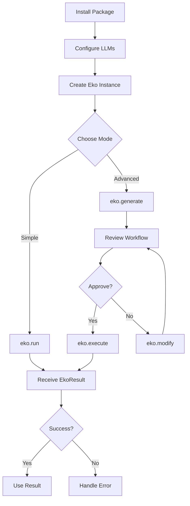
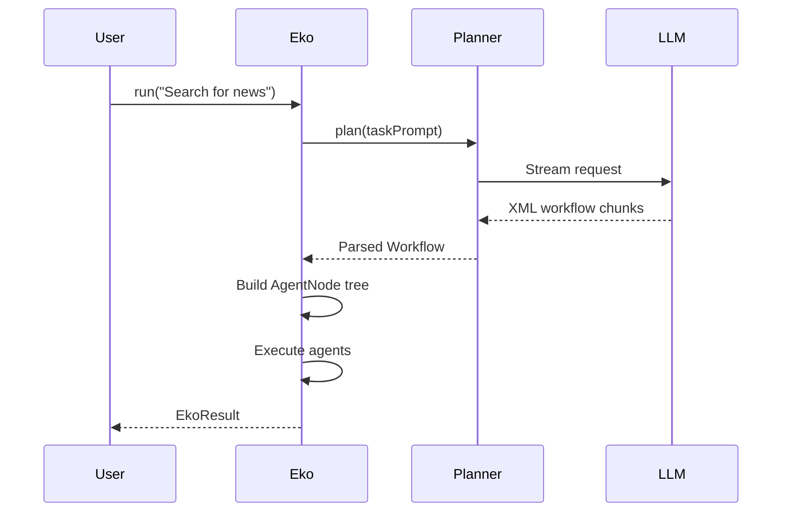
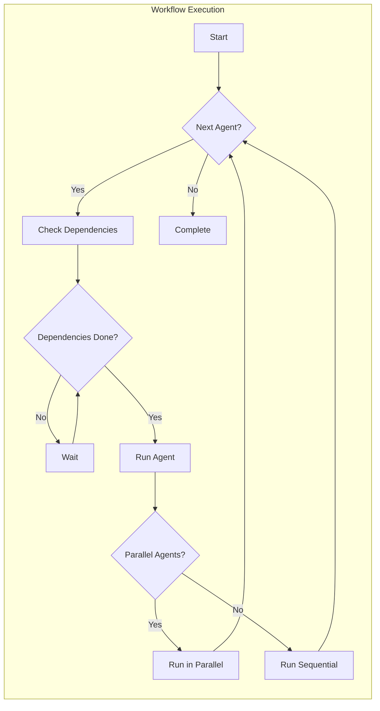
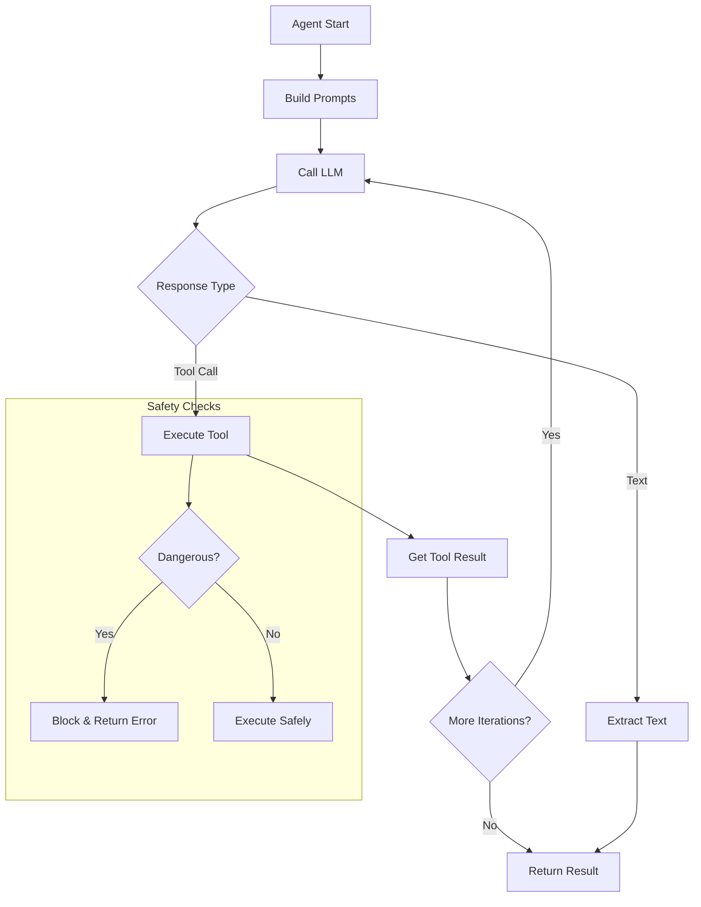
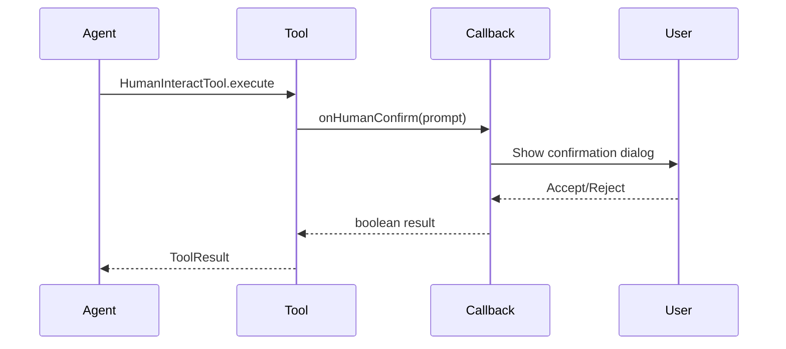
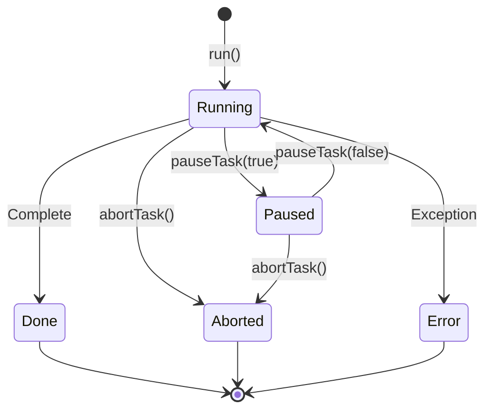
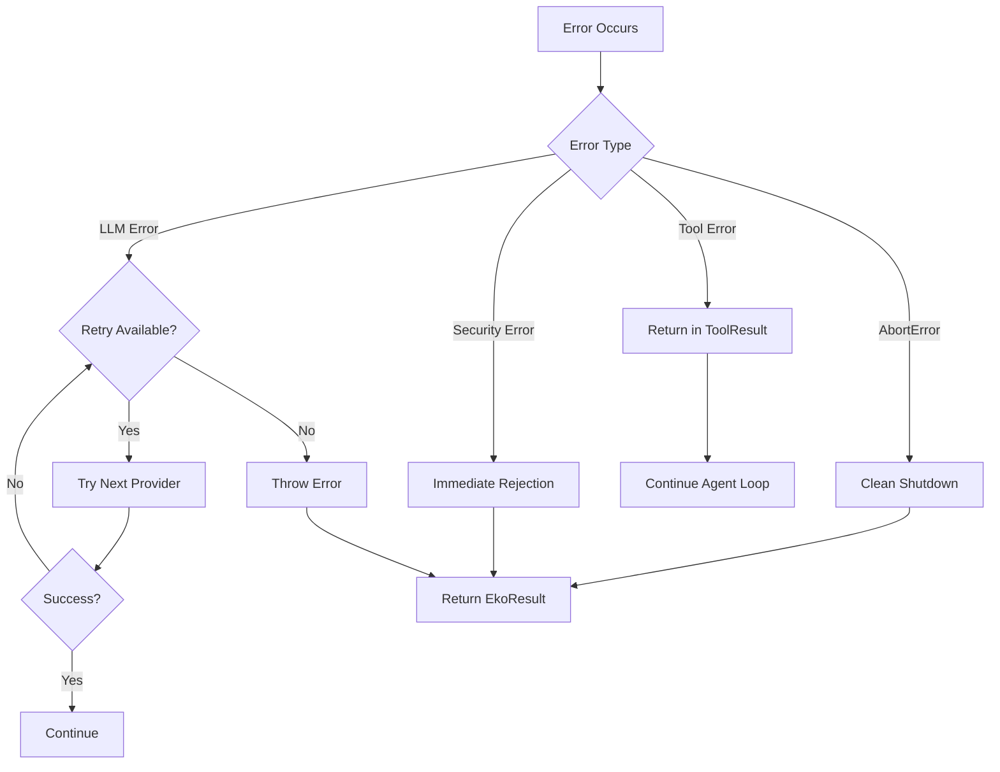
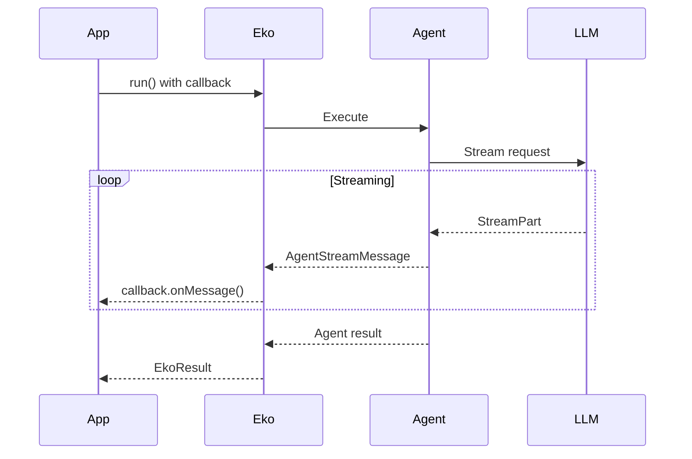
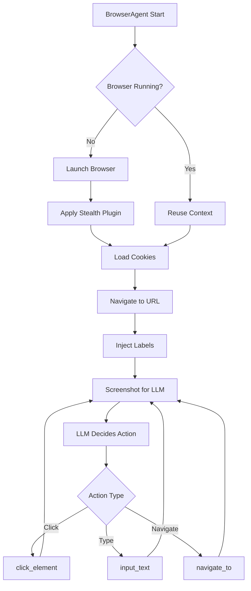
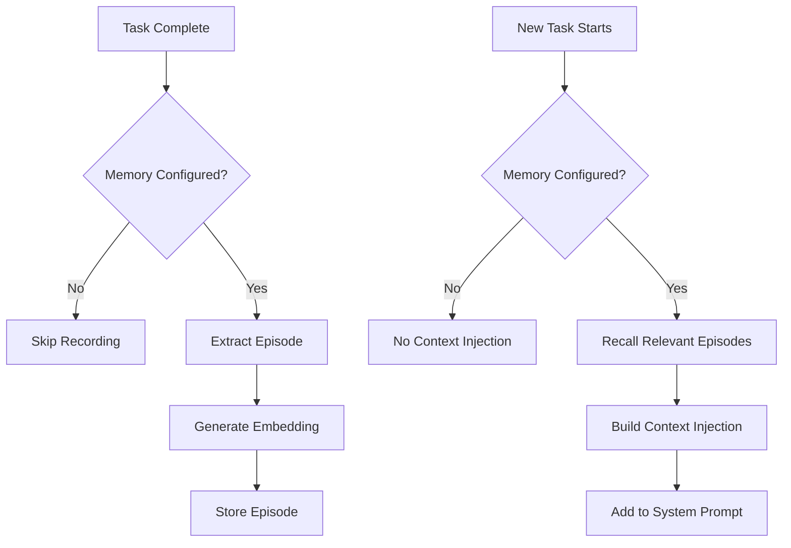

# User Flow Documentation
## Eko AI Framework

---

## 1. Overview

This document describes the user flows for developers integrating and using the Eko AI Framework.

---

## 2. Primary User Flow

### 2.1 SDK Integration Flow



### 2.2 Step-by-Step

| Step | Action | Code |
|------|--------|------|
| 1 | Install | `pnpm add @eko-ai/eko @eko-ai/eko-nodejs` |
| 2 | Import | `import { Eko } from '@eko-ai/eko'` |
| 3 | Configure | Set up LLMs object with API keys |
| 4 | Create | `new Eko({ llms, agents })` |
| 5 | Execute | `await eko.run('task prompt')` |
| 6 | Process | Handle result or error |

---

## 3. Workflow Generation Flow



---

## 4. Agent Execution Flow



---

## 5. Tool Execution Flow (ReAct Loop)



---

## 6. Human-in-the-Loop Flow



### Interaction Types

| Type | Callback | User Action |
|------|----------|-------------|
| Confirm | `onHumanConfirm` | Yes/No button |
| Input | `onHumanInput` | Text field |
| Select | `onHumanSelect` | Dropdown/Checkboxes |
| Help | `onHumanHelp` | Login/Assistance request |

---

## 7. Task Control Flow



### Control API

```typescript
// Pause execution
eko.pauseTask(taskId, true, false, 'User requested pause');

// Resume execution
eko.pauseTask(taskId, false);

// Abort execution
eko.abortTask(taskId, 'User cancelled');
```

---

## 8. Error Handling Flow



---

## 9. Streaming Output Flow



### Message Types Timeline

```
workflow      → agent_start → tool_use → tool_result → ... → agent_result
    │              │             │            │                    │
    └──────────────┴─────────────┴────────────┴────────────────────┘
                        Streaming Messages
```

---

## 10. Browser Automation Flow



---

## 11. Episodic Memory Flow



### Episode Data Flow

```
Task Execution
     │
     ├──► goal: Original prompt
     ├──► plan: Generated workflow
     ├──► actions: Tools called
     ├──► outcome: Final result
     ├──► success: Boolean
     └──► lesson: Generated insight
            │
            ▼
     Storage Provider
            │
            ▼
     Future Task Recall
```

---

## 12. Edge Cases

| Scenario | Handling |
|----------|----------|
| Network failure | Retry with exponential backoff |
| LLM rate limit | Switch to fallback provider |
| Browser crash | Attempt recovery via `recoverBrowserContext()` |
| Timeout | Return partial result with `killed: true` |
| Invalid input | Zod validation error before execution |
| Circular dependencies | Detected during workflow parsing |
